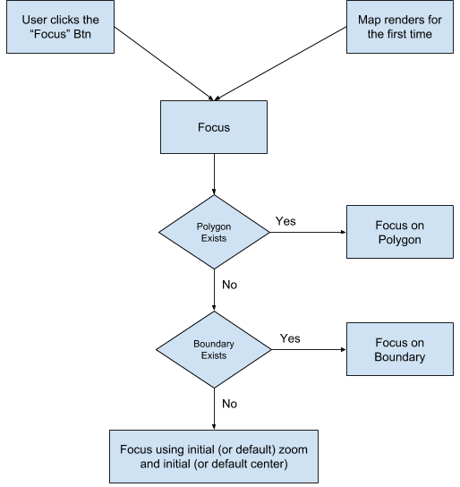

# Polygon Editor React

### Table of contents

-   About
-   Specification (pl)
-   Getting started
-   Components
-   How to run locally
-   Contribution

### About

React Polygon Editor provides react components for displaying and editing polygons.
We use leaflet for rendering maps. And typescript to provide a strongly typed interface.

### Specification (pl)

- [] Możliwość dodawania nowego wielokąta, usuwania oraz edycji
- [] Przy edycji:
   - [x] przesuwanie wierzchołka
   - [x] usuwanie wierzchołka
   - [x] dodawanie wierzchołka w środku wybranej krawędzi
   - [] przesuwanie całej krawędzi
   - [] przesuwanie całego wielokąta
- [] Dodawanie ograniczeń (relacji) dla wybranej krawędzi:
   - [] możliwe ograniczenia:
      - [] krawędź pozioma, krawędź pionowa
      - [] dwie sąsiednie krawędzie nie mogą być obie pionowe lub obie poziome
      - [] dodawanie wierzchołka na krawędzi lub usuwanie wierzchołka - usuwa ograniczenia "przyległych" krawędzi
      - [] ustawione ograniczenia są widoczne (jako odpowiednie "ikonki") przy środku krawędzi
      - [] powinna istnieć mozliwość usuwania relacji
- [] Włączanie/wyłączanie wielokąta odsuniętego.
   - [] dla prawidłowego wielokąta (zamknięta łamana bez samoprzecięć) - wielokąt odsunięty nie ma samoprzecięć!
   - [] może istnieć kilka składowych (spójnych) wielokąta odsuniętego
   - [] możliwość płynnej zmiany offsetu (tylko dodatni)
   - [] płynna aktualizacja wielokąta oduniętego podczas modyfikacji wielokąta
   - [] Rysowanie odcinków - algorytm biblioteczny i własna implementacja (alg. Bresenhama) - radiobutton
- [] Definiowanie nowego wielokąta oraz przesuwanie - jak najbardziej intuicyjne
- [] !!!Predefiniowana scena (min 2 wielokąty) z ograniczeniami
Proszę również o przygotowanie prostej dokumentacji (może być w notatniku) zawierającej:
   - [] instrukcji obsługi - "klawiszologia"
   - [] przyjętych założeń i opisu zaimplementowanego algorytmu "relacji" oraz wyznaczania wielokąta odsuniętego

Termin oddania zadania - tydzień: 24,25 października, 2 listopada. W trakcie tych zajęć - część laboratoryjna.

### Getting started

First install @freenow/react-polygon-editor:

```bash
nvm use 18 && npm install
```

Make sure you have also installed all peer dependencies. Have a look at [package.json](package.json) for more information.

Actualy the nice decission of the installation instruction would be to run the following:
```bash
npm i -S react react-dom react-leaflet leaflet styled-components
```

If there is the need, we may also suggest injection the leaflet css style of the leaflet library.

```bash
Import 'leaflet/dist/leaflet.css';
```

Also, the one nice solution of the adding the own styling to the leafles component: linking the css style from a CDN in your index.html

```html
<link rel="stylesheet" href="https://unpkg.com/leaflet@1.4.0/dist/leaflet.css" />
```

### Components

##### PolygonDraw

**Props**

-   **polygon**: _Coordinate[] | Coordinate[][]_ (Single or list of polygons to render)
-   **activeIndex**?: _number_ (index of currently active polygon, can be omitted when only one polygon exists. **Default value: 0**)
-   **highlightedIndex**?: _number_ (index of the polygon that should be highlighted.)
-   **boundary**?: _Coordinate[]_
-   **initialCenter**?: _Coordinate_ (The initial center will be used to localize the map on the first render if no polygon or boundary polygon were provided)
-   **initialZoom**?: _number_ (The initial zoom will be used to localize the map on the first render if no polygon or boundary polygon were provided)
-   **editable**?: _boolean_ (Allows enabling and disabling polygon editing. **Default value: true**)
-   **onChange**?: _(polygonCoordinates: Coordinate[], isValid: boolean) => void_
-   **onClick**?: _(index: number) => void_ (called with the index of the polygon that was clicked on)
-   **onMouseEnter**?: _(index: number) => void_ (called with the index of the polygon that was entered)
-   **onMouseLeave**?: _(index: number) => void_ (called with the index of the polygon that was left)

The initialCenter and initialZoom props are applicable only when both the polygon and the boundary coordinates are empty.
This flow explains which parameters are used to focus the map:



For more details, have a look at the Component definition in [PolygonDraw](src/PolygonDraw/PolygonDraw.tsx)

### How to run locally

In the project, we use [storybook](https://storybook.js.org/) to illustrate what can be done with the components and the whole polygon editor.

Simply run:

```bash
npm install && npm start
```

